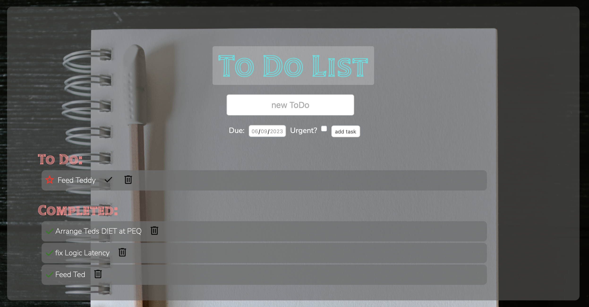

# TodoListMongoDB
Simple ToDo list using Node, Express and MongoDB/Mongoose. This was a mini project to solidify concepts and syntax of connecting to a database and implementing full CRUD operations with RESTful routes.

